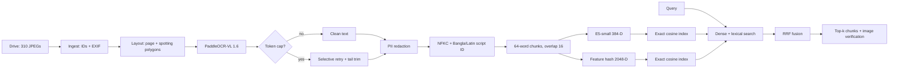

# Knowledge-base pipeline

OCR is resumable and cached. Failed pages can take a second OCR path using an Rx-anchor crop. After OCR, both final indexes build in about 8.7 seconds. Exact cosine is intentional: 943 chunks are too few to justify approximate search or ANN recall loss.
